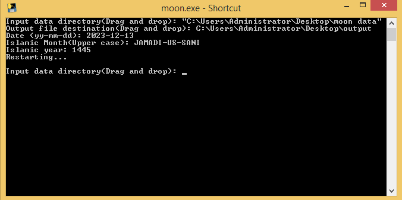
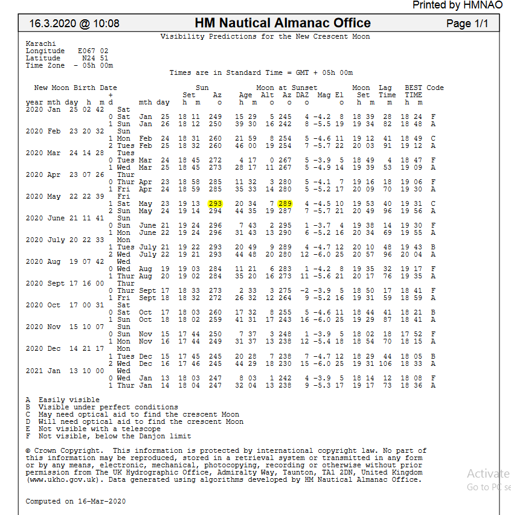
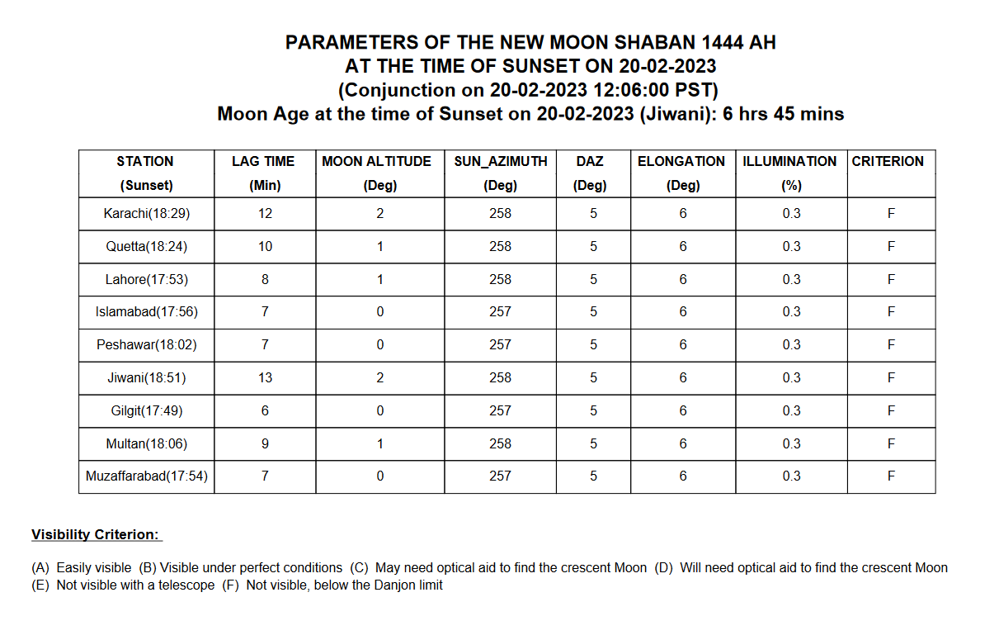

# Moonpy

## Overview
Moonpy is a software specifically designed to read data provided by HM nautical almanac office. It generates pdf file that could be used to predict the visibility of the crecent. Moonpy can run on python version 3.6.

## Command line Interface

* The software needs the location of data directory(where the data resides) and the output directory(where you want to store the output file). 
* Enter the date for which the data will be required in "yy-mm-dd" format.
* Provided Islamic month and Islamic year will be printed on output pdf file.

    

## Data Preprocessing
* Data can be downloaded from HM Nautical Almanac Office website in .txt format
* Each file in input directory contains location wise data for example Karachi.txt, Multan.txt etc.
* Remove text and irrelevent information from data manually using text editor like Notepad++, and the replace header with " year  h   cd conj  f wk   mon  day  set   Saz    age  Alt Maz  dz  Mag El  mset  lag   best  cat".

    

## Output
* Moonpy output automatically opens up in your default browser and saved in the given ouput directory simultaneously.

 

 ## Next update
* To exclude preprocessing the data and remove irrelevent texts and replace the headers accordingly.
* Sorting the list of cities according to their numbers.   

